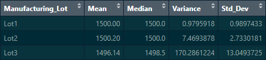
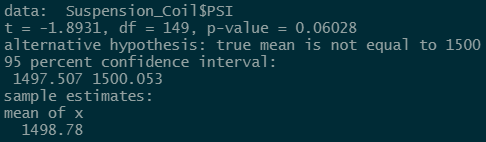
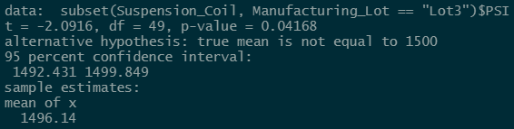

# MechaCar Statistical Analysis

RStudio was used to load csv files and perform statistical analyses, such as linear regression and Student t-tests.

## MPG Statistics

The following is the results of a linear regression:

The vehicle length, ground clearance, and slope appear to be statistically significant values. This is evidenced by the Pr(>|t|) values being less than 0.05.

This linear regression, having an r-squared value above 0.7, effectively predicts the correlation between mpg and the other variables.

## Suspension Coil Statistics

### Overall Statistics

### Statistics by Lot

Althought the parts in aggregate pass the manufacturer's specification of variance less than 100 psi, Lot 3 was grossly out of spec with a variance of 170 psi.

## Suspension Coil PSI T-test

## Overall

The Student t-test resulted in a 95% confidence interval that includes the desired mean of 1500 PSI.

Lot 3 fails the Student t-test, with a p-value below 0.05 and a 95% confidence interval that does not contain the target value of 1500 PSI. The other lots passed the t-test for this measure.