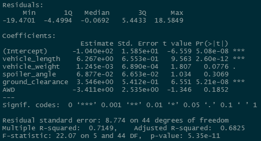

# MechaCar Statistical Analysis

Deliverable 1

The following is the results of a linear regression:

The vehicle length, ground clearance, and slope appear to be statistically significant values. This is evidenced by the Pr(>|t|) values being less than 0.05.

This linear regression, having an r-squared value above 0.7, effectively predicts the correlation between mpg and the other variables.

Deliverable 2

